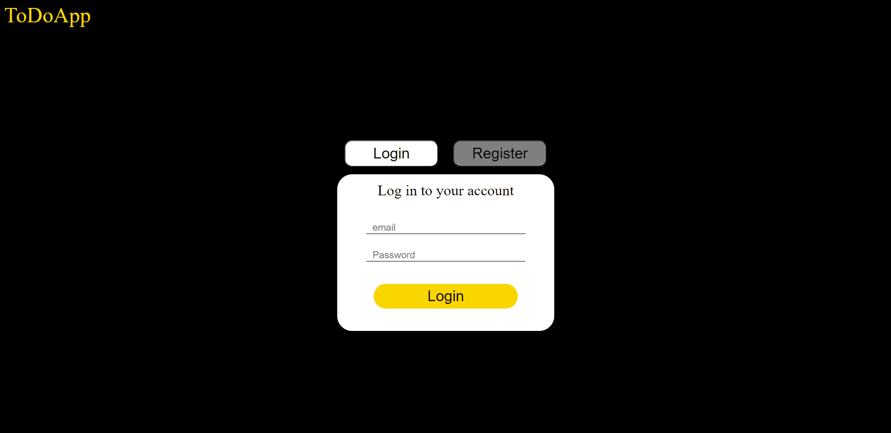
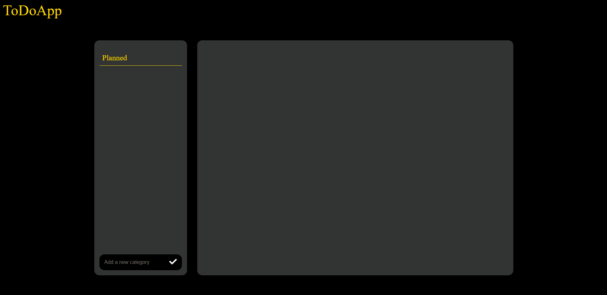

# ToDoApp2
### It's a simple app allowing you to manage your daily tasks.
### I've created it in order to learn Spring Boot, Angular and API documentation using Swagger.
### I've used the following technologies:
- Spring Boot
- Spring Security
- Spring Data JPA
- Angular
- Swagger
- PostgreSQL

#

### Registering a new user and authentication with data verification demo: 

### Managing your tasks demo:
